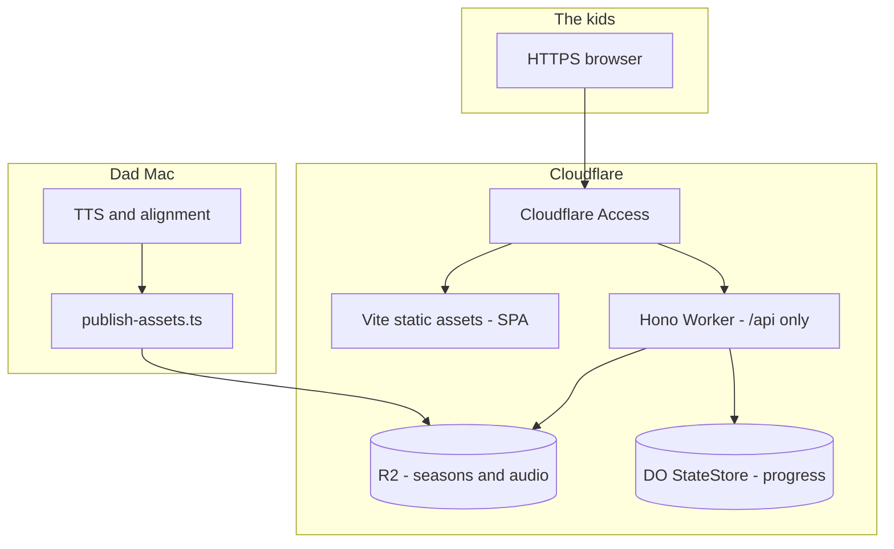

# Typeling — Cloudflare deployment plan

Status: draft  
Owner: Season  
Related: [PRD](./prd-cloudflare-deploy.md) (product framing and acceptance criteria)

## Goal

Let the kids open Typeling from Windows anytime, without Dad’s Mac running `bun run dev`. The app runs on Cloudflare; audio and season content live in R2; progress lives in a Durable Object; TTS and asset publishing stay on the Mac.

## Research summary (platform changes that matter)

These Cloudflare releases shape *how* we deploy Typeling (Vite/React SPA, Hono API, R2 assets, single-writer state).

| When | What | Why it matters |
|------|------|----------------|
| Apr 2025 | [@cloudflare/vite-plugin 1.0](https://blog.cloudflare.com/introducing-the-cloudflare-vite-plugin/) | One Vite project: React build + Hono Worker; local dev in **workerd**; `vite build` then `wrangler deploy`. |
| Jun 2025 | [`run_worker_first` route patterns](https://developers.cloudflare.com/changelog/2025-06-17-advanced-routing/) | Serve static assets cheaply; only `/api/*` invokes the Worker. Requires Wrangler ≥4.20, vite-plugin ≥1.7. |
| Apr 2025 | [SQLite Durable Objects GA](https://developers.cloudflare.com/changelog/post/2025-04-07-sqlite-in-durable-objects-ga/) (10 GB/object) | Fits `state.json` semantics (single writer, strong consistency). Use `new_sqlite_classes` on first deploy. Storage billing from Jan 2026. |
| Ongoing | [R2 ranged `get()`](https://developers.cloudflare.com/r2/api/workers/workers-api-usage/) | `range: request.headers` for audio scrub (206 + `Content-Range`). |
| Oct–Dec 2025 | [One-click Access for Workers](https://developers.cloudflare.com/changelog/post/2025-10-03-one-click-access-for-workers/) + [reusable policies](https://developers.cloudflare.com/changelog/post/2025-12-03-reusable-access-policies/) | Email allowlist before any kid-facing URL. |
| 2025+ | [Workers Builds](https://developers.cloudflare.com/workers/ci-cd/builds/) | Git push → build → deploy; autoconfig PR if no Wrangler file yet. |
| Apr 2026 | [Containers + Sandboxes GA](https://developers.cloudflare.com/changelog/post/2026-04-13-containers-sandbox-ga/) | Full Linux/Bun possible, but **not** the default for this app (see below). |

### Runtime reality

Cloudflare Workers is **not** Bun.

- [`nodejs_compat`](https://developers.cloudflare.com/workers/runtime-apis/nodejs/) covers `node:crypto` (episode integrity hashes) and other Node APIs; there is **no real filesystem**.
- `Bun.serve`, `Bun.file`, and `Bun.write` must be replaced with Worker `fetch`, R2, and Durable Object storage.
- Bun remains the **local** toolchain: `bun test`, `bun add`, `bun run scripts/*`.

Current server coupling (must abstract):

- `Bun.env` for paths and `PORT`
- `Bun.file` for seasons, audio, and state
- `Bun.serve` on `127.0.0.1` for local-only boot
- `node:fs/promises` `rename` for atomic state writes

Audio **Range** forwarding is required for cloud (scrub bar) but is **not** implemented in the server yet — Step 3 adds it.

---

## Recommended architecture

**Use Workers + static assets + R2 + SQLite Durable Object.** Do not default to Containers.



| Option | Verdict |
|--------|---------|
| Workers + Vite plugin + R2 + DO | **Recommended** — small family app, Hono is edge-native, matches product constraints. |
| Cloudflare Containers (Bun in Docker) | Escape hatch only if porting blocks; still needs R2/DO; higher cost and complexity. |
| Pages without Worker | Wrong — API, state, and ranged audio need a Worker. |

---

## Prerequisites (Phase 0)

Before Step 1:

1. **Cloudflare account** with Workers Paid plan ($5/mo minimum for R2, DO, custom routes in production).
2. **Dev dependencies** (when implementing): `wrangler`, `@cloudflare/vite-plugin`, `@cloudflare/workers-types`.
3. **Tool versions**: Wrangler ≥4.20, `@cloudflare/vite-plugin` ≥1.7 (for `run_worker_first` arrays).
4. **Scaffold path** (pick one when coding):
   - `npm create cloudflare@latest` — React + Workers template, or
   - Add `@cloudflare/vite-plugin` to existing `vite.config.ts` per [React + Vite on Workers](https://developers.cloudflare.com/workers/framework-guides/web-apps/react/).

### Target Wrangler shape

```jsonc
{
  "$schema": "node_modules/wrangler/config-schema.json",
  "name": "typeling",
  "main": "src/server/index.ts",
  "compatibility_date": "2026-05-27",
  "compatibility_flags": ["nodejs_compat"],
  "assets": {
    "not_found_handling": "single-page-application",
    "run_worker_first": ["/api/*"]
  },
  "r2_buckets": [
    {
      "binding": "ASSETS_BUCKET",
      "bucket_name": "typeling-assets"
    }
  ],
  "durable_objects": {
    "bindings": [
      {
        "name": "STATE",
        "class_name": "StateStore"
      }
    ]
  },
  "migrations": [
    {
      "tag": "v1",
      "new_sqlite_classes": ["StateStore"]
    }
  ]
}
```

**Routing behaviour**

- `run_worker_first: ["/api/*"]` — static JS/CSS/CSS do not hit Hono.
- SPA navigations can avoid Worker billing when `compatibility_date` is recent enough; see [SPA routing](https://developers.cloudflare.com/workers/static-assets/routing/single-page-application/).

**Worker entry**

- Export `default { fetch }` from the server module (already have `fetch`); keep `Bun.serve` only under `import.meta.main` for local Bun, or split `worker.ts` / `local.ts`.

**Local dev**

- Cloud-shaped dev: Vite + Cloudflare plugin (`wrangler dev` via plugin).
- Keep Portless / `bun run dev:direct` as `dev:legacy` until cloud path is kid-validated.

---

## Build order (seven steps)

Each step is shippable; local Bun dev stays available until both kids validate cloud end-to-end.

### Step 1 — Port server off Bun runtime APIs

**Blocker for everything else.** Cloudflare does not run Bun.

| Today | Cloudflare |
|-------|------------|
| `Bun.file` / `Bun.write` | R2 + DO storage APIs |
| `Bun.env` | `env` on `Hono<{ Bindings: Env }>` |
| `Bun.serve` | Worker `export default { fetch }` |
| `node:fs` atomic rename (state) | DO transactional storage |
| Disk paths for seasons/audio | R2 object keys |

Introduce:

- **`AssetStore`** — seasons, audio, timings (R2 in prod; in-memory in tests).
- **`StateStore`** — `readState` / `mutateState` (DO in prod; in-memory in tests).

Hono route handlers should stay thin; only I/O boundaries change.

**Done when:** `wrangler dev` serves all `/api/*` with the same response shapes as today’s Bun server; existing route tests pass against in-memory backends via `app.request()`.

---

### Step 2 — Seasons in R2

- Bucket `typeling-assets` (name TBD), prefix `seasons/`.
- `GET /api/children/:id/season` and episode endpoints read from R2, not `seasons/`.
- Deploy pipeline uploads **code** only; season JSON is published via Step 5.

**Done when:** Season/episode API works with no local `seasons/` folder in the Worker environment.

---

### Step 3 — Audio in R2 + Range support

- Store WAV + word-timing JSON under e.g. `audio/{season}/{episode}/`.
- Implement `GET .../audio/file` with R2 ranged reads:

```ts
const object = await env.ASSETS_BUCKET.get(key, {
  range: c.req.headers,
  onlyIf: c.req.headers,
});
// Return 206 with appropriate headers when ranged
```

**Done when:** Deployed app plays synced audio; scrub bar can seek mid-chapter.

**Out of scope:** Cache API edge caching for audio (per PRD).

---

### Step 4 — Replace `data/state.json` with Durable Object

- Class name **`StateStore`** — locked by migration tag `v1`; do not rename after first deploy.
- Single DO instance (e.g. `idFromName("typeling")`) for one-family, single-writer semantics.
- Use **`new_sqlite_classes`** (SQLite-backed DO), not legacy KV-only DO.
- Preserve `createStateQueue` contract: idempotent `POST /api/sessions`, three `409` mismatch codes, `current_episode` rules.
- Seed from `data/state.seed.json` on first empty storage.

**Done when:** Session and progress behaviour matches local file semantics under concurrent requests.

---

### Step 5 — Publishing script

- `scripts/publish-assets.ts` — walk `seasons/` and `data/audio/`, upload to R2.
- Idempotent: `HEAD` + content hash, skip unchanged keys.
- `--dry-run` lists changes without writes.
- Run on Mac after TTS; not in Worker.

**Done when:** Second run uploads nothing if assets unchanged; one changed file uploads one key.

---

### Step 6 — Login gate (Cloudflare Access)

**Before sharing any URL with the kids** — including `*.workers.dev`.

1. Deploy Worker to `workers.dev`.
2. Dashboard → Worker → Settings → Domains & Routes → **Enable Cloudflare Access**.
3. Allow policy: specific **Emails** (Dad and the kids).
4. Optional hardening: validate `Cf-Access-Jwt-Assertion` in Worker (dashboard gate is enough for family use).

**Done when:** Unlisted email blocked; allowed three reach the app.

---

### Step 7 — Custom domain

- Route e.g. `typeling.<domain>` to the Worker.
- Access policy on that hostname.
- Kids bookmark the custom URL.

**Done when:** HTTPS custom domain works; `bun run dev` / legacy flow still works as rollback.

---

## CI/CD and secrets

| Concern | Approach |
|---------|----------|
| App deploy | Workers Builds: `vite build`, `wrangler deploy` on push to `main`. |
| Asset deploy | Manual from Mac: `bun run scripts/publish-assets.ts` (R2 token in env, not in git). |
| TTS / API keys | Stay on Mac only; never on Worker. |
| PR previews | Default `wrangler versions upload` (preview, not promoted). |

---

## Testing

Four scopes (from PRD); all against behaviour, not Cloudflare internals:

1. **Asset reads** — integrity / sidecar checks via `AssetStore` in-memory backend (`EpisodeAudioStale`, etc.).
2. **State writes** — DO contract via in-memory `StateStore`: idempotency, 409s, `current_episode`, reset.
3. **Route handlers** — `app.request()` with in-memory bindings: access matrix, audio 404/409, **Range → 206**.
4. **Publish script** — idempotency and `--dry-run`.

Optional pre-kid check: `wrangler dev` with **remote R2** binding for one episode smoke test.

---

## What stays unchanged

- React UI, typing rules, WPM, reducers, validators (charset, British English, fictional names).
- TTS pipeline on Dad’s Mac (Gemini, Qwen3, `speech` CLI).
- Bun for local toolchain and tests.
- `bun run dev` / legacy until cloud validated with both kids.

## Out of scope

- Multi-tenant / third child / public deploy without Access.
- Server-side mid-episode save, PIN, replay, iPad, illustrations, eval automation, backup rotation.
- TTS inside Worker.
- SSR for React.
- Cache API for audio.

## Explicit non-goals (architecture)

1. **Containers first** — only if Step 1 is blocked for a long time.
2. **Pages-only** — cannot host API + DO + ranged audio.
3. **Public URL before Access** — never.

## Cost (rough)

Two kids, low traffic: Workers Paid + small R2 + one DO should stay near the $5/mo base. SQLite DO storage (billed since Jan 2026) is negligible at this scale. Containers add active-CPU cost without benefit here.

## Follow-ups (optional)

- Swap `node:crypto` for Web Crypto and drop `nodejs_compat` if bundle size matters.
- Workers Builds on this repo after Step 1 lands.
- Track implementation issues mirroring Steps 1–7.

## References

- [Cloudflare Vite plugin blog](https://blog.cloudflare.com/introducing-the-cloudflare-vite-plugin/)
- [React + Vite on Workers](https://developers.cloudflare.com/workers/framework-guides/web-apps/react/)
- [SPA routing](https://developers.cloudflare.com/workers/static-assets/routing/single-page-application/)
- [Worker script routing (`run_worker_first`)](https://developers.cloudflare.com/workers/static-assets/routing/worker-script/)
- [R2 from Workers](https://developers.cloudflare.com/r2/api/workers/workers-api-usage/)
- [Durable Objects get started](https://developers.cloudflare.com/durable-objects/get-started/)
- [Workers Builds](https://developers.cloudflare.com/workers/ci-cd/builds/)
- [Cloudflare Access for Workers](https://developers.cloudflare.com/changelog/post/2025-10-03-one-click-access-for-workers/)
